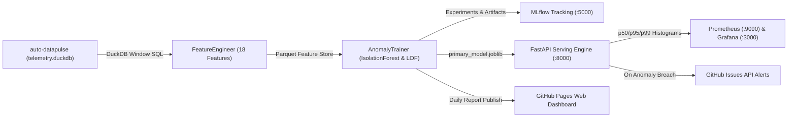

# 🚀 Homelab-MLOps: Self-Hosted Anomaly Detection & Model Governance Engine

[](https://github.com/siddharthsbhadauria/homelab-mlops/actions/workflows/ci.yml)
[](https://github.com/siddharthsbhadauria/homelab-mlops/actions/workflows/deploy_pages.yml)
[](https://siddharthsbhadauria.github.io/homelab-mlops/)

> 🌐 **Live Web Application**: [https://siddharthsbhadauria.github.io/homelab-mlops/](https://siddharthsbhadauria.github.io/homelab-mlops/)

**Homelab-MLOps** is an end-to-end, production-grade telemetry anomaly detection platform and MLOps pipeline designed for self-hosted infrastructure (**UGREEN NAS / Docker / Portainer**). It seamlessly integrates with [`auto-datapulse`](https://github.com/siddharthsbhadauria/auto-datapulse), ingesting raw system telemetry from an embedded **DuckDB** OLAP store, engineering 18 sliding-window features, benchmarking **scikit-learn** models with **MLflow** tracking, serving inferences via **FastAPI** with **Prometheus** metrics, and dispatching automated incident alerts via the **GitHub Issues API**.

---

## 🏗️ Architecture Overview



---

## 🛠️ Tech Stack & Engineering Concepts

* **Data Source & Feature Store**: [auto-datapulse](https://github.com/siddharthsbhadauria/auto-datapulse) DuckDB store, SQL sliding-window feature engineering (1h/6h rolling stats, rates of change), and Parquet versioning.
* **ML Algorithms & Benchmarking**: `scikit-learn` Isolation Forest and Local Outlier Factor (LOF) with contamination tuning.
* **Experiment Tracking & Governance**: MLflow 2.14 for hyperparameter logging, metric curves, model artifact registration, and tag lifecycle management.
* **Online Serving & Microservice**: FastAPI + Uvicorn with Pydantic v2 validation and sub-10ms inference.
* **Observability & Metrics**: Prometheus 2.53 (`model_predictions_total`, `model_prediction_latency_seconds`, `model_anomaly_score`) and pre-provisioned Grafana 11.1 dashboards.
* **Automated Alerting**: GitHub REST API for automatic diagnostic issue dispatching with duplicate suppression.
* **Container Orchestration**: Docker Compose and Portainer Git repository deployment.

---

## 📐 Feature Store Matrix (18 Features)

```
Instantaneous Metrics:   cpu_percent, ram_percent, disk_percent
1-Hour Rolling Stats:    cpu_rolling_mean_1h, cpu_rolling_std_1h, ram_rolling_mean_1h, ram_rolling_std_1h, disk_rolling_mean_1h, disk_rolling_std_1h
6-Hour Rolling Stats:    cpu_rolling_mean_6h, cpu_rolling_std_6h, ram_rolling_mean_6h, ram_rolling_std_6h
First-Order Derivative:  cpu_rate_of_change, ram_rate_of_change, disk_rate_of_change
Cyclical Time Embeds:    hour_of_day (0-23), day_of_week (0-6)
```

---

## 🚢 Deploying on UGREEN NAS via Portainer

1. Open **Portainer** on your NAS (`http://<nas-ip>:9443` or `9000`).
2. Navigate to **Stacks** $\rightarrow$ **+ Add stack**.
3. Select **Repository** build method:
   - **Repository URL**: `https://github.com/siddharthsbhadauria/homelab-mlops`
   - **Repository reference**: `refs/heads/main`
   - **Compose path**: `docker-compose.yml`
4. Set Environment Variables:
   - `GITHUB_TOKEN`: `ghp_your_personal_access_token`
   - `GITHUB_REPO`: `siddharthsbhadauria/homelab-mlops`
   - `DATAPULSE_DATA_PATH`: `/volume1/docker/auto-datapulse/data`
   - `PIPELINE_INTERVAL_SECONDS`: `21600` (6 hours)
   - `MONITOR_INTERVAL_SECONDS`: `900` (15 minutes)
   - `CONTAMINATION`: `0.05`
5. Click **Deploy the stack**.

---

## 🚀 Running Locally

```bash
# 1. Clone repository
git clone https://github.com/siddharthsbhadauria/homelab-mlops.git
cd homelab-mlops

# 2. Configure environment
cp .env.example .env

# 3. Launch Docker Compose stack
docker compose up -d --build
```

**Service Endpoints:**
* 🚀 **FastAPI Docs**: [http://localhost:8000/docs](http://localhost:8000/docs)
* 🧪 **MLflow UI**: [http://localhost:5000](http://localhost:5000)
* 📈 **Grafana Dashboards**: [http://localhost:3000](http://localhost:3000) *(admin / homelab)*
* 🎯 **Prometheus Targets**: [http://localhost:9090](http://localhost:9090)

---

## 🧪 Testing

```bash
# Install test dependencies
pip install -r requirements.txt
pip install pytest pytest-cov httpx ruff

# Run linter & test suite
ruff check src/ tests/
pytest tests/ -v --cov=src --cov-report=term-missing
```

---

## 🛡️ License
Distributed under the MIT License — see the [LICENSE](LICENSE) file for details.
